# Lab 02: Building and Customizing Prompt Flows

#### Estimated Duration: 90 Minutes

## Overview

In this lab, you will gain hands-on experience in initializing a Prompt Flow project in Microsoft Foundry, setting up the necessary environment to begin developing, testing, and refining AI applications. You will create and customize prompts within Microsoft Foundry's Prompt Flow. Starting with the creation of a new flow, you will add and configure the Prompt tool and develop a flow incorporating LLM (Large Language Model) and Prompt tools. By authoring a sample flow and running it with custom inputs, you'll learn how to monitor flow execution and evaluate outputs, thereby understanding the practical steps involved in developing, testing, and refining AI-driven workflows.

## Objectives

In this lab, you will perform the following:

- Task 1: Initialize a Prompt Flow Project
- Task 2: Create and Customize Prompts
- Task 3: Develop a Flow with LLM and Prompt Tools

### Task 1: Initialize a Prompt Flow Project

In this task, you will set up a structured environment to manage and streamline prompt-based AI tasks. This involves creating a project directory, configuring essential files and dependencies, and establishing a workflow for designing, testing, and refining prompts. Organizing prompts, data, and evaluation metrics in one place ensures consistency and efficiency, helping you optimize prompt performance and achieve better results with your AI models.

1. Navigate to the Azure Portal using the link below:

    ```
    https://portal.azure.com
    ```

    > **Note:** If not already logged in, use the below credentials in the sign-in window, to sign in using the provided Azure credentials
      
      - Enter your **Email/Username:** <inject key="AzureAdUserEmail"></inject> and click **Next** to continue.

        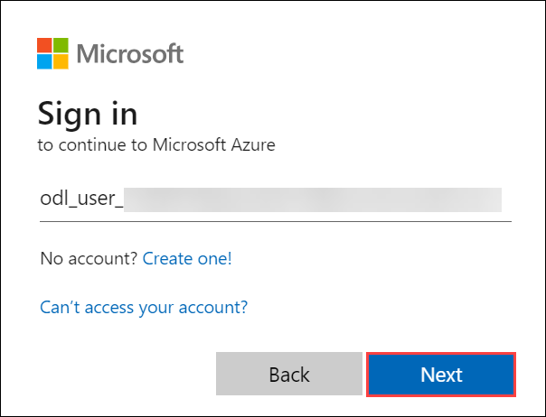

      - Enter **Password:** <inject key="AzureAdUserPassword"></inject> and click **Sign in**

        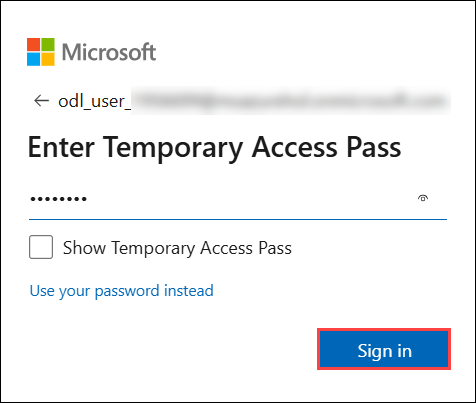

1. Search for **Microsoft Foundry (1)** in the Azure portal and select **Microsoft Foundry (2)** from the Services list.  

    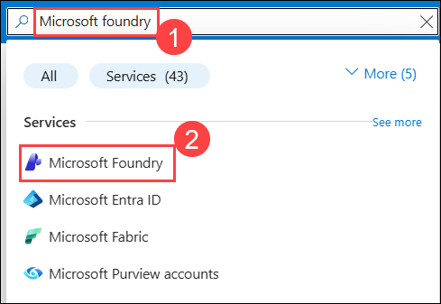

1. Once the **Microsoft Foundry** page opens, select **AI Hubs (1)** under **Use with Foundry** from the left panel. Click on **+ Create (2)** and select **Hub (3)** from the drop-down. 

    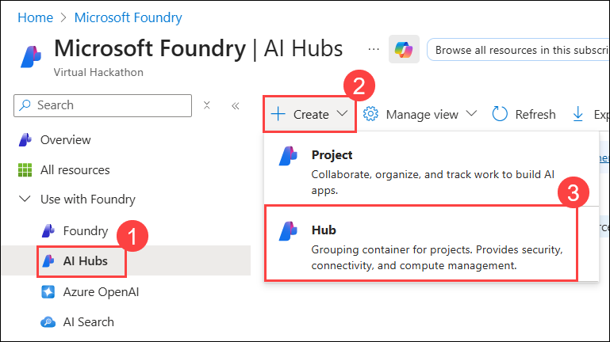

1. In the **Basics** tab of **Azure AI hub** page, follow these instructions to fill out the properties:

   - Subscription: **Set as default (1)**
   - Resource group: **ODL-MEMT-<inject key="DeploymentID" enableCopy="false"/>  (2)**  
   - Region: **<inject key="Region" enableCopy="false"/> (3)**
   - Name: **modelhub<inject key="DeploymentID" enableCopy="false"/>**  **(4)**
   - Connect AI Services, incl. OpenAI: Click on **Create new** **(5)**
   - On the Create new Azure AI Services pane: Enter **ai-modelhub<inject key="DeploymentID" enableCopy="false"/>  (6)** 
   - Select **Save (7)**
   - Review the details filled and click on **Review + create (8)**.

        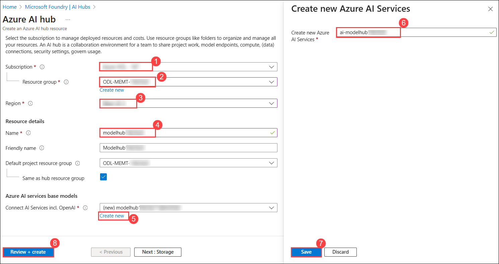

1. Click on **Create** once the validation passes to create the **Hub**. 

    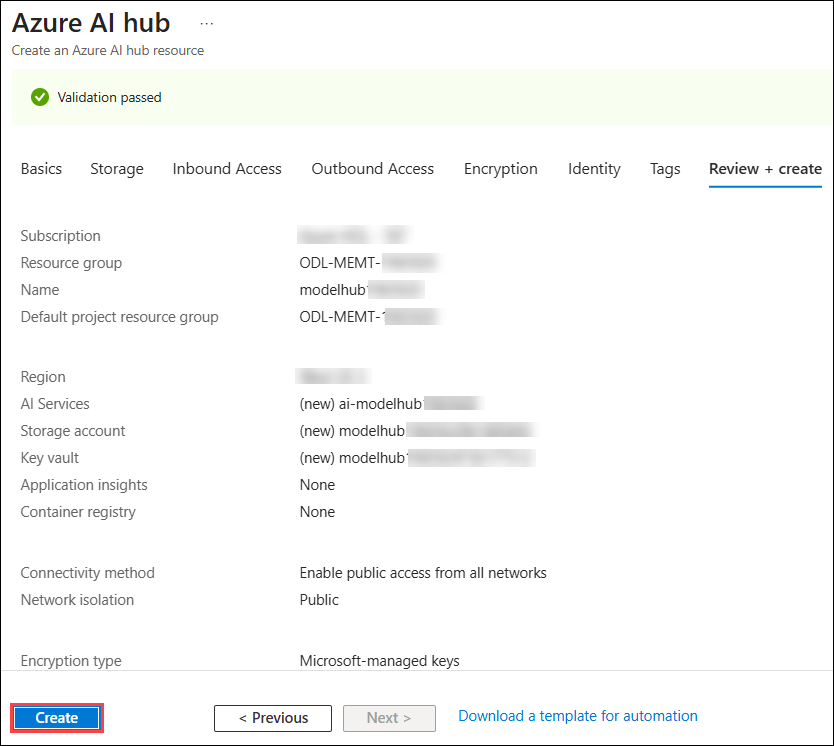

1. After the deployment has succeeded, click on **Go to resource**.

    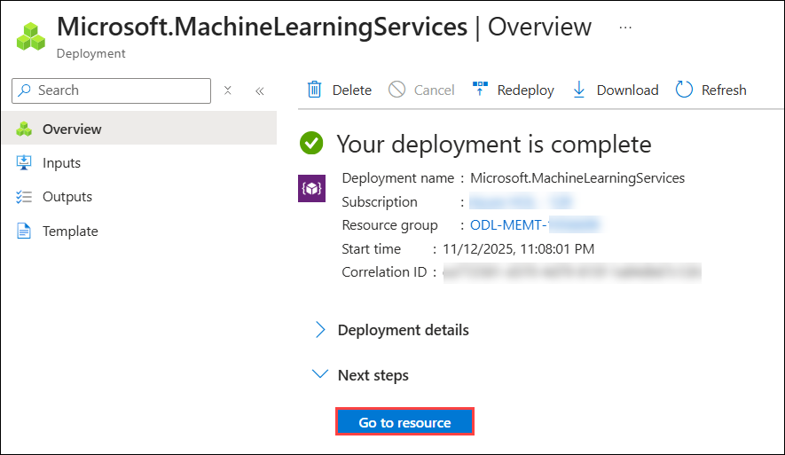

1. On the **Azure AI hub** page, select **Overview (1)** and click on the **Launch Azure AI Foundry (2)** option visible. This will take you to the Microsoft Foundry portal. 

    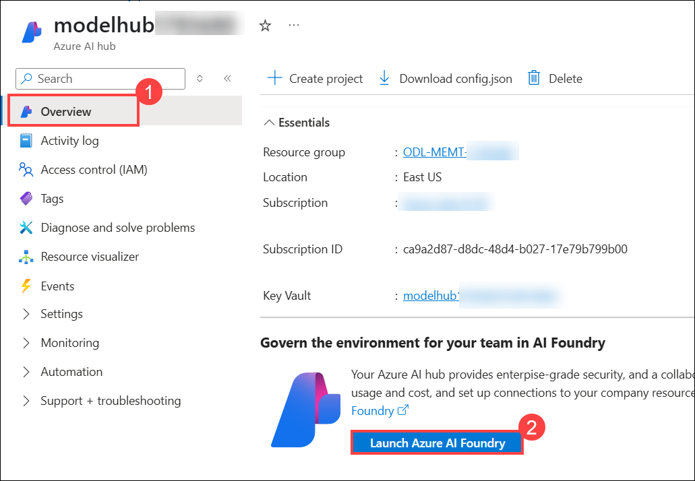

1. On the **Microsoft Foundry** portal, under Hub **Overview (1)**, scroll down and select **+ New project (2)**.

    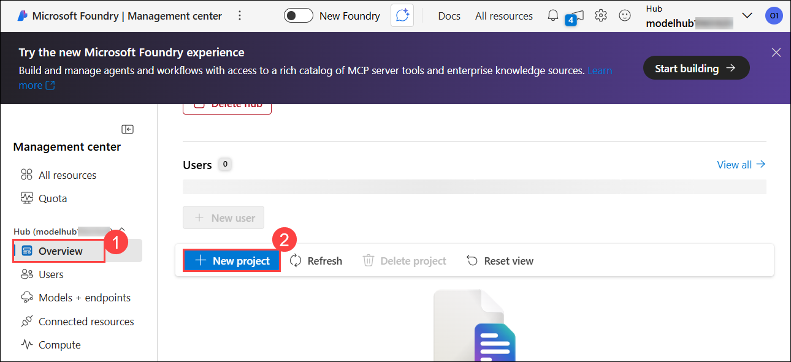

1. Let the **Current hub (1)** option load, provide the **Project name** as **modelproject-<inject key="DeploymentID" enableCopy="false"/>** **(2)** and click on **Create (3)**. 

    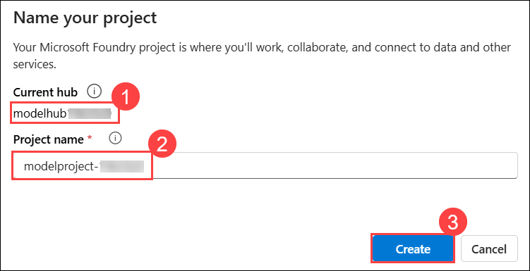

1. Once the project creation is completed, you will be navigated to that project. You will be performing further tasks in this project **modelproject-<inject key="DeploymentID" enableCopy="false"/>**.

    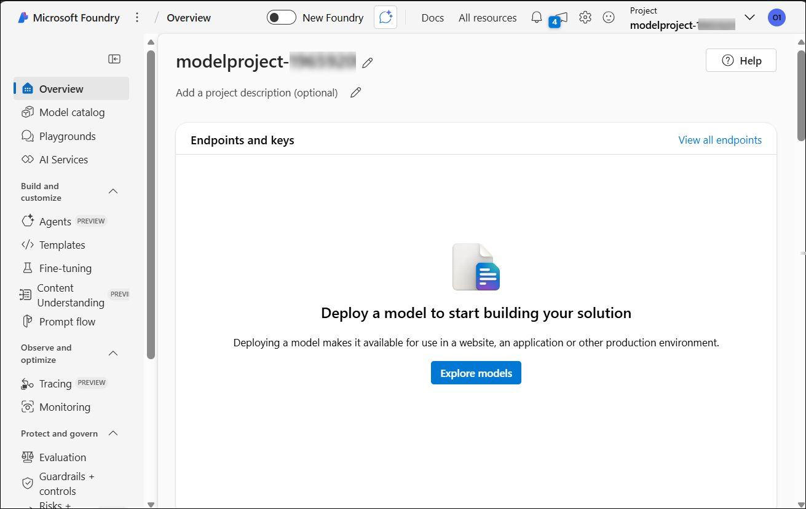

    > **Note:** If any pop-up appears, click on **Close**.

      
     
> **Congratulations** on completing the task! Now, it's time to validate it. Here are the steps:
> - Hit the Validate button for the corresponding task.
> - If you receive a success message, you can proceed to the next task.
> - If not, carefully read the error message and retry the step, following the instructions in the lab guide. 
> - If you need any assistance, please contact us at cloudlabs-support@spektrasystems.com. We are available 24/7 to help you out.
<validation step="85914800-05d0-40dd-80ca-292f5415040a" />

### Task 2: Create and Customize Prompts

In this task, you will focus on creating and customizing prompts by designing targeted and purposeful questions or statements that guide the LLM toward generating accurate and useful responses. You'll define clear objectives, consider the intended audience, and use precise language to ensure relevance. Customization will help align prompts with specific contexts or use cases, improving engagement and effectiveness in applications like education, customer support, and AI-driven workflows.

1. From the left navigation menu, under **My assets**, select **Model + endpoints (1)**.

1. On the **Manage deployments of your models and services**, under **Model deployments** tab, select **+ Deploy model (2)** and then select **Deploy base model (3)** from the dropdown.

   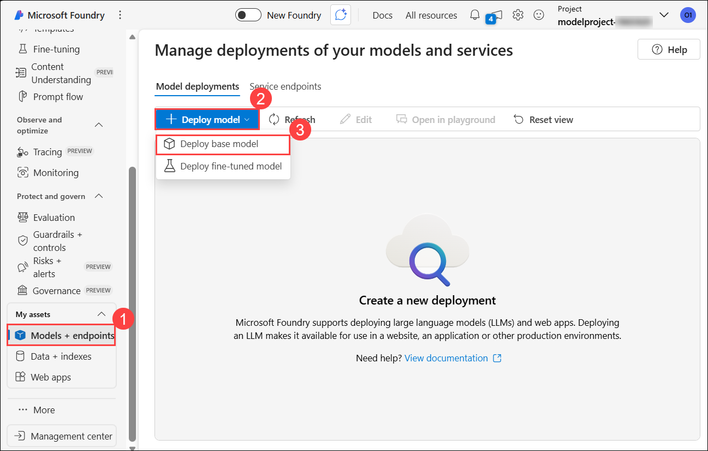

1. On the **Select a model** page, search for **gpt-4.1 (1)** and select **gpt-4.1 (2)**, select **Confirm (3)** under the **gpt-4.1**.

   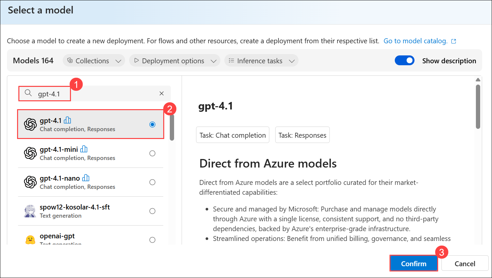

1. On **Deploy model gpt-4.1** page, select **Customize**.

      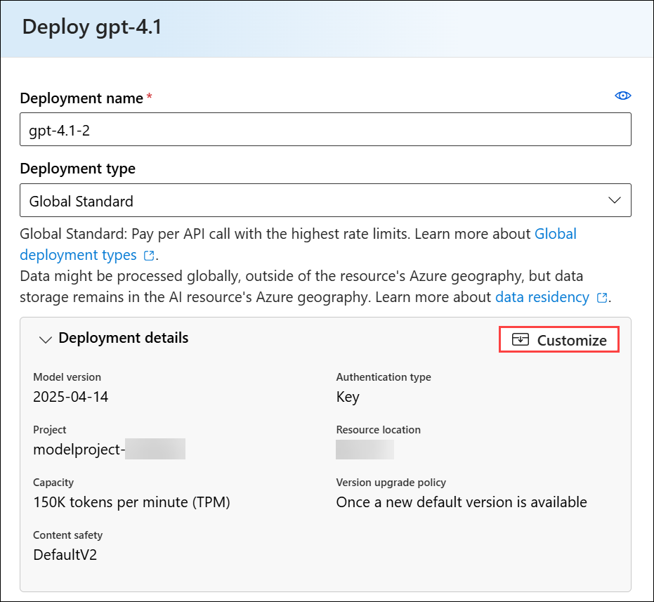

1. On the **Deploy model gpt-4.1** page, follow these instructions to create the deployment:

   - Deployment name: **gpt-4.1 (1)**
   - Deployment type:  **Global Standard (2)**
   - Model version: **2025-04-14 (Default) (3)**
   - AI resource: select **ai-modelhub<inject key="DeploymentID" enableCopy="false"/> (4)**
   - Tokens per Minute Rate Limit (thousands): **5 K (5)**
      > **Note:** Use the &rarr; (right arrow) key on the keyboard to set the Enqueued Tokens (Limit) to 5k.
   - Content filter: **DefaultV2 (6)**
   - Select **Connect and deploy (7)**

     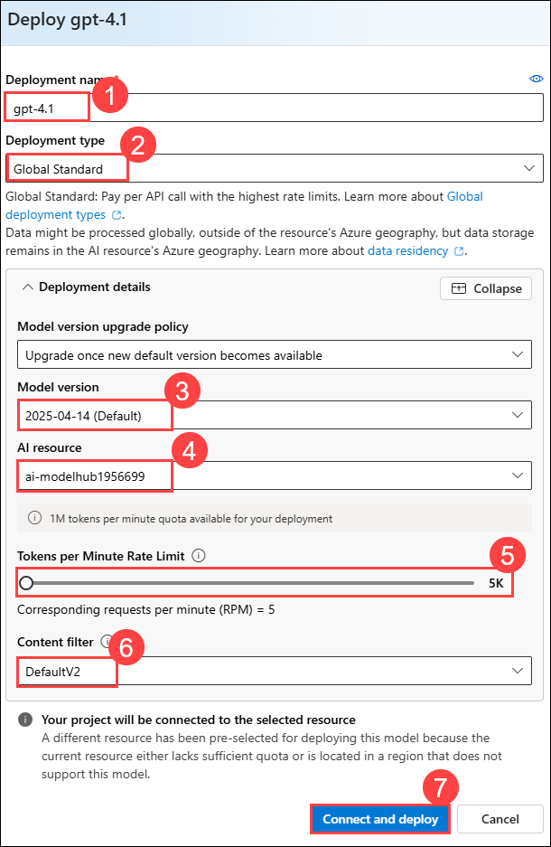

     >**Note:** If you see an error stating **"Failed to get the connection NotFoundError: Connection Default_AzureOpenAI can't be found in this workspace."** or a similar message, simply ignore it and refresh the page. Your model is already deployed.

1. From the left navigation pane, select **Prompt flow (1)** under **Build and customize** and click **+ Create (2)** to add the Prompt tool to your flow.

   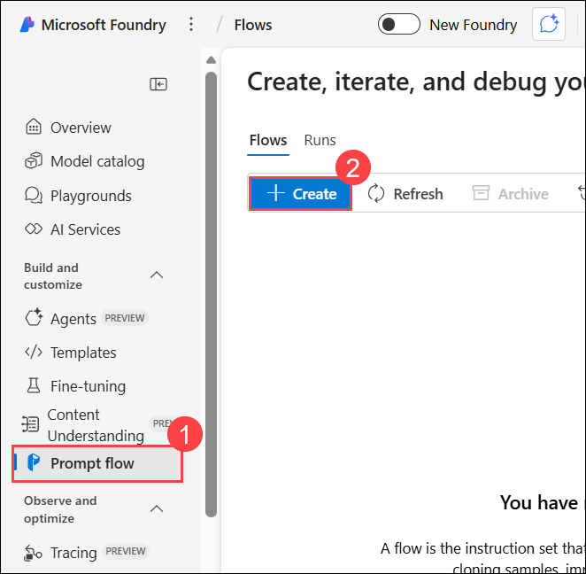

1. On **Create a new flow** blade, under **Standard flow**, click on **Create (1)**, then enter below provided Folder name **(2)**, and click on **Create (3)**

   ```
   promptflow-<inject key="DeploymentID" enableCopy="false"/> 
   ```

    >**Note:** **Please make sure to follow the note provided in the same step, just below the screenshot, as it addresses an error you may encounter while creating the Prompt Flow**.

     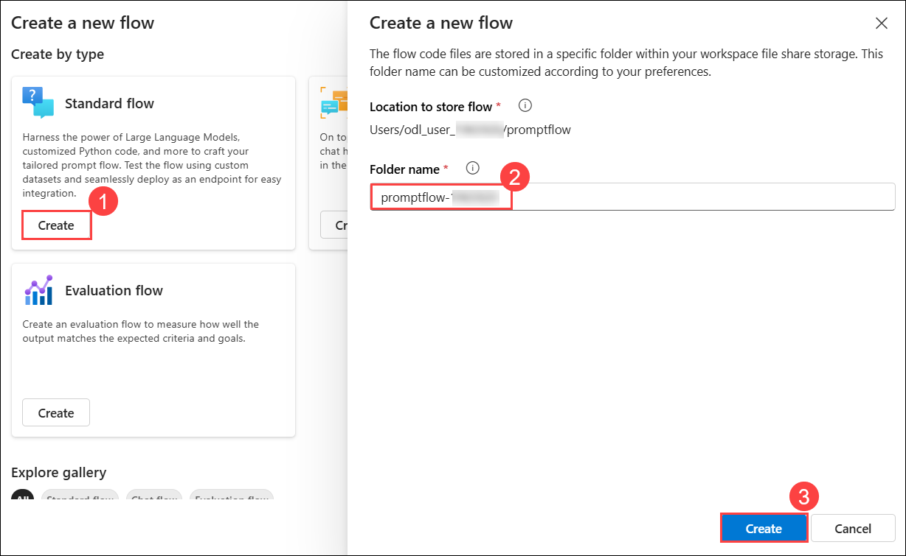

      >**Note:** If you encounter permission errors like "Cloud Dependency Permission" or see a "Folder name already exists" message, wait for 5 minutes and then try recreating the prompt flow using a unique name. Sometimes the system may not accept the original name, so try a few different variations until it succeeds. Once the flow is created, rename it to **promptflow-<inject key="DeploymentID" enableCopy="false"/> (2)** by selecting the **edit icon (1)** and clicking on **Save (3)**.

       

> **Congratulations** on completing the task! Now, it's time to validate it. Here are the steps:
> - Hit the Validate button for the corresponding task.
> - If you receive a success message, you can proceed to the next task.
> - If not, carefully read the error message and retry the step, following the instructions in the lab guide. 
> - If you need any assistance, please contact us at cloudlabs-support@spektrasystems.com. We are available 24/7 to help you out.
<validation step="97dc69b4-95e6-4d6b-9b64-b143ebe6290b" />

### Task 3: Develop a Flow with LLM and Prompt Tools

In this task, you will develop a flow with Large Language Models (LLMs) and prompt tools by defining a clear objective, selecting the appropriate LLM, and crafting structured prompts to guide the model’s responses. You will iteratively refine these prompts based on the output to ensure accuracy and relevance. Prompt tools will help you manage and optimize the interaction, enabling efficient use of LLMs for tasks such as content creation, data analysis, or automated support.

1. The prompt flow authoring page opens. You can start authoring your flow now. By default, you see a sample flow. This example flow has nodes for the LLM and Python tools.

1. Optionally, you can add more tools to the flow. The visible tool options are **LLM, Prompt, and Python**. 

    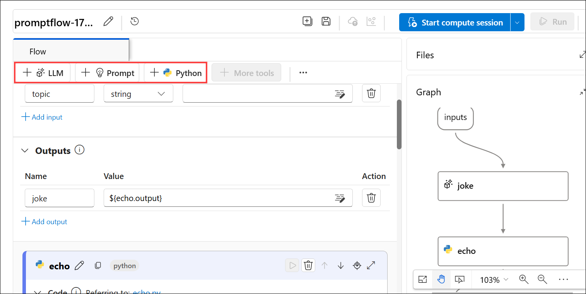

1. From the **Graph**, select **joke (1)**. Choose an existing connection **ai-modelhub<inject key="DeploymentID" enableCopy="false"/>_aoai (2)** from the drop-down menu, and for deployment, select the newly created deployment, **gpt-4.1 (3)**, in the LLM tool editor.

   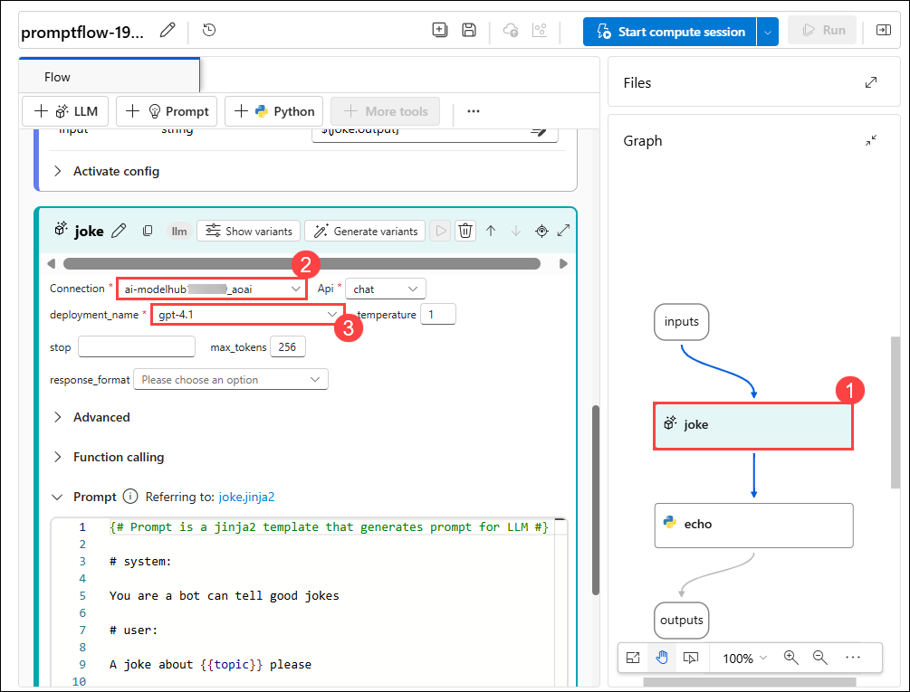

1. Scroll up to the **Inputs (1)** section enter any fruit name of your choice like **Apple (2)** in the **Value** field for the topic.

    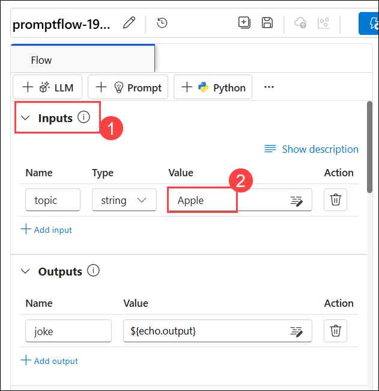

1. Select **Save (1)**, and click on **Start compute session (2)**.

    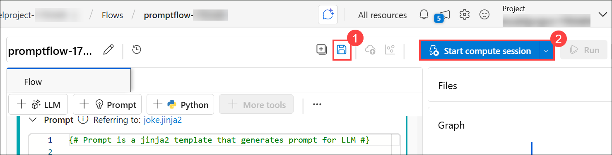

   >**Note:** Sometimes, it may take `10–15` minutes for the compute session to start. This delay is due to a portal glitch, so please be patient. There’s no alternative but to wait until the session becomes active. Once the compute session starts, you can see as **Compute session running**

    
    
1. Once the compute session is complete, click the **play** button inside the **joke** node to run the **joke node** first, then run the **echo node**.

    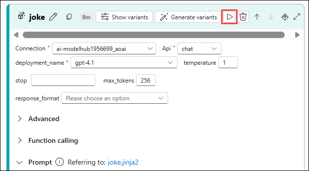

1. Click on the **echo (1)** node from the graph and click on the **Play (2)** button.

    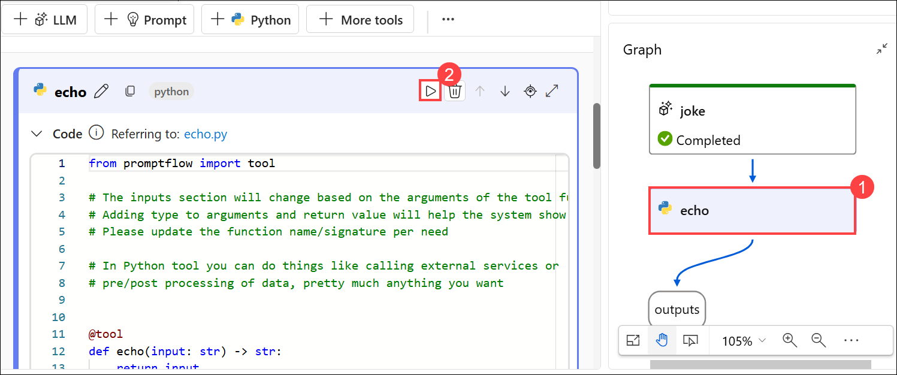
  
1. Once both the nodes have successfully executed, select **Run** from the toolbar.

   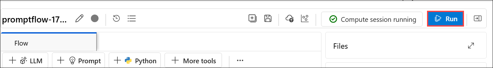

1. Once the flow run is completed, scroll down to the **Outputs** section and select **View full output** to view the flow results. The output will look similar to the image shown below.

     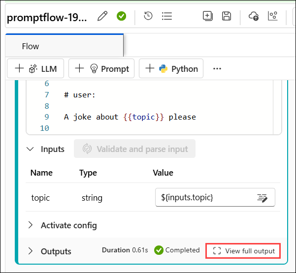

1. You can view the flow run status and output.

    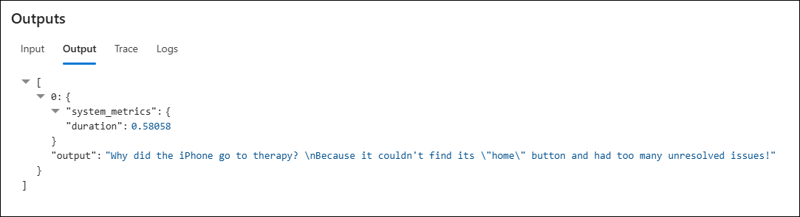

    >**Note:** The output may vary as the joke node generates a random joke based on the input topic, which in this case is "Apple". You can experiment with different inputs to see how the output changes.

1. From the top menu, select **+ Prompt (1)** to add the Prompt tool to your flow, give the name of the flow as **modelflow (2)**, and select **Add (3)**.

   

   .png)

1. Add this code inside the **model flow** prompt tool **(1)**, and select **Validate and parse input (2)**

   ```jinja
   Welcome to Joke Bot !
   
    Hello, {{ user_name }}!
   
    Hello there!
   
   Pick a category from the list below and get ready to laugh:
   1. 🐶 Animal Jokes – From pets to wildlife, it’s a zoo of laughs.
   2. 💼 Office Humor – Relatable jokes for the 9-to-5 grind.
   3. 💻 Tech & Programmer Jokes – Debug your mood with geeky giggles.
   4. 📚 School & Exam Jokes – A+ comedy for students and survivors.
   5. ⚡ One-Liners – Quick, witty, and straight to the funny bone.
   6. 😏 Sarcastic Jokes – Dry, sharp, and deliciously savage.
   ```

   

1. In the **Inputs** section of the newly added Prompt, add the following value, select **Save (2)** and **Run (3)**.

   - user_name: **John (1)** in the **Value** field

     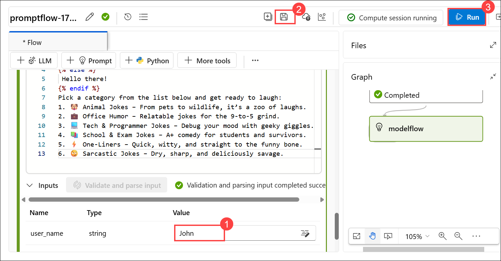

1. If you encounter any warnings while running, as shown in the screenshot below, click **Run anyway**.

   

1. Once the flow run is completed, from the **Outputs** section below, select **View full output** to view the flow results. The output will look similar to the image shown below.

   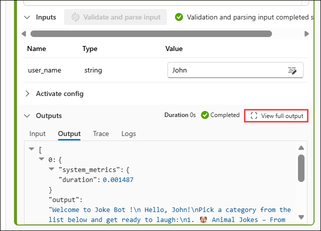

1. You can view the flow run status and output in the Outputs section.

   
   
## Summary

In this lab, you have completed the following tasks:

- Initialize a Prompt Flow Project
- Created and Customized Prompts
- Developed a Flow with LLM and Prompt Tools

### You have successfully completed the lab. Click on **Next >>** to proceed with the next Lab.


