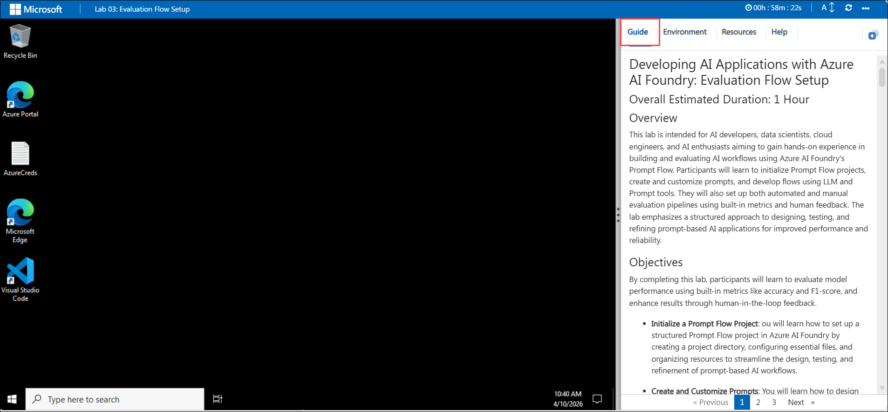

# Developing AI Applications with Microsoft Foundry: Evaluation Flow Setup

## Overall Estimated Duration: 1 Hour

## Overview 

This lab is intended for AI developers, data scientists, cloud engineers, and AI enthusiasts aiming to gain hands-on experience in building and evaluating AI workflows using Microsoft Foundry's Prompt Flow. Participants will learn to initialize Prompt Flow projects, create and customize prompts, and develop flows using LLM and Prompt tools. They will also set up both automated and manual evaluation pipelines using built-in metrics and human feedback. The lab emphasizes a structured approach to designing, testing, and refining prompt-based AI applications for improved performance and reliability.

## Objectives 

By completing this lab, participants will learn to evaluate model performance using built-in metrics like accuracy and F1-score, and enhance results through human-in-the-loop feedback.

- **Initialize a Prompt Flow Project**: ou will learn how to set up a structured Prompt Flow project in Microsoft Foundry by creating a project directory, configuring essential files, and organizing resources to streamline the design, testing, and refinement of prompt-based AI workflows.

- **Create and Customize Prompts**: You will learn how to design and tailor prompts to guide LLMs effectively, aligning them with specific objectives and use cases to enhance the accuracy, relevance, and impact of AI-generated responses.

- **Develop a Flow with LLM and Prompt Tools**: You will learn how to build a flow using LLM and Prompt tools by defining objectives, crafting and refining prompts, and leveraging model outputs to create effective, task-specific AI workflows.

- **Set Up Evaluation Metrics**: You will learn how to define evaluation criteria, collect human feedback, and analyze model outputs to assess performance, accuracy, and potential biases through a manual evaluation process.

- **Set Up Automated Evaluation with Built-in Metrics**: You will learn how to configure automated evaluation using built-in metrics such as accuracy, precision, recall, and F1-score to efficiently measure and monitor model performance.

## Prerequisites 

Participants should have: 
Basic knowledge and understanding of the following
 
 - Azure Portal
 - Microsoft Foundry

## Architecture 

- **Azure Portal** : The Azure Portal is a unified web-based console that provides a comprehensive interface for managing Azure resources. It allows users to build, manage, and monitor everything from simple web apps to complex cloud applications.
- **Microsoft Foundry** : Microsoft Foundry is a development environment for building, training, and deploying AI models. It provides tools and services to streamline the AI development lifecycle, including data preparation, model training, evaluation, and deployment.

## Architecture Diagram: 

  

## Explanation of Components 

- **Building and Customizing Prompt Flows**: Tailoring interactions enhances user engagement and satisfaction. Fine-tuning flows creates dynamic, responsive experiences that meet specific needs, leading to better outcomes and a personalized touch.

- **Evaluation Flow Setup**: This lab focuses on setting up and analyzing evaluation flows for an AI model in Microsoft Foundry. You will systematically review model responses to diverse inputs, assessing performance based on key evaluation criteria. By defining and applying metrics like coherence and fluency, you will automate the evaluation process using a structured dataset. Through this hands-on experience, you will develop a deeper understanding of model assessment techniques and optimization strategies to improve AI performance.

## Getting Started with the Lab
 
Welcome to your Developing AI Applications with Microsoft Foundry Workshop! We've prepared a seamless environment for you to explore and learn about the connection between creating, evaluating, and fine-tuning AI models using Prompt Flow. You'll develop custom AI models, automate evaluations, fine-tune performance, and integrate chat flows, all while ensuring responsible AI practices with Content Safety Foundry. Let's begin by making the most of this experience:
  
## Accessing Your Lab Environment
 
Once you're ready to dive in, your virtual machine and **Guide** will be right at your fingertips within your web browser.

### Virtual Machine & Lab Guide
 
Your virtual machine is your workhorse throughout the workshop. The lab guide is your roadmap to success.
 
### Exploring Your Lab Resources
 
To get a better understanding of your lab resources and credentials, navigate to the **Environment** tab.

 
## Utilizing the Split Window Feature
 
For convenience, you can open the lab guide in a separate window by selecting the **Split Window** button from the Top right corner.

 
## Managing Your Virtual Machine

Feel free to **start, stop, or restart (2)** your virtual machine as needed from the **Resources (2)** tab. Your experience is in your hands!

## Lab Validation

After completing the task, hit the **Validate** button under Validation tab integrated within your lab guide. If you receive a success message, you can proceed to the next task, if not, carefully read the error message and retry the step, following the instructions in the lab guide.

### Lab Guide Zoom In/Zoom Out

To adjust the zoom level for the environment page, click the **A↕ : 100%** icon located next to the timer in the lab environment.  

## Let's Get Started with Azure Portal

1. On your virtual machine, click on the **Azure Portal** icon as shown below:

   
   
1. You'll see the **Sign into Microsoft Azure** tab. Here, enter your credentials:
 
   - **Email/Username:** <inject key="AzureAdUserEmail"></inject>
 
       
 
1. Next, provide your password:
 
   - **Password:** <inject key="AzureAdUserPassword"></inject>
 
       
    
1. If prompted to stay signed in, you can click **No**.
 
1. If a **Welcome to Microsoft Azure** pop-up window appears, simply click **Cancel** to skip the tour.

## **Support Contact**

1. The CloudLabs support team is available 24/7, 365 days a year, via email and live chat to ensure seamless assistance at any time. We offer dedicated support channels tailored specifically for both learners and instructors, ensuring that all your needs are promptly and efficiently addressed.

   Learner Support Contacts:

    - Email Support: cloudlabs-support@spektrasystems.com
    - Live Chat Support: https://cloudlabs.ai/labs-support

2. Now, click on **Next** from the lower right corner to move on to the next page.

   
 
### Happy Learning!!
